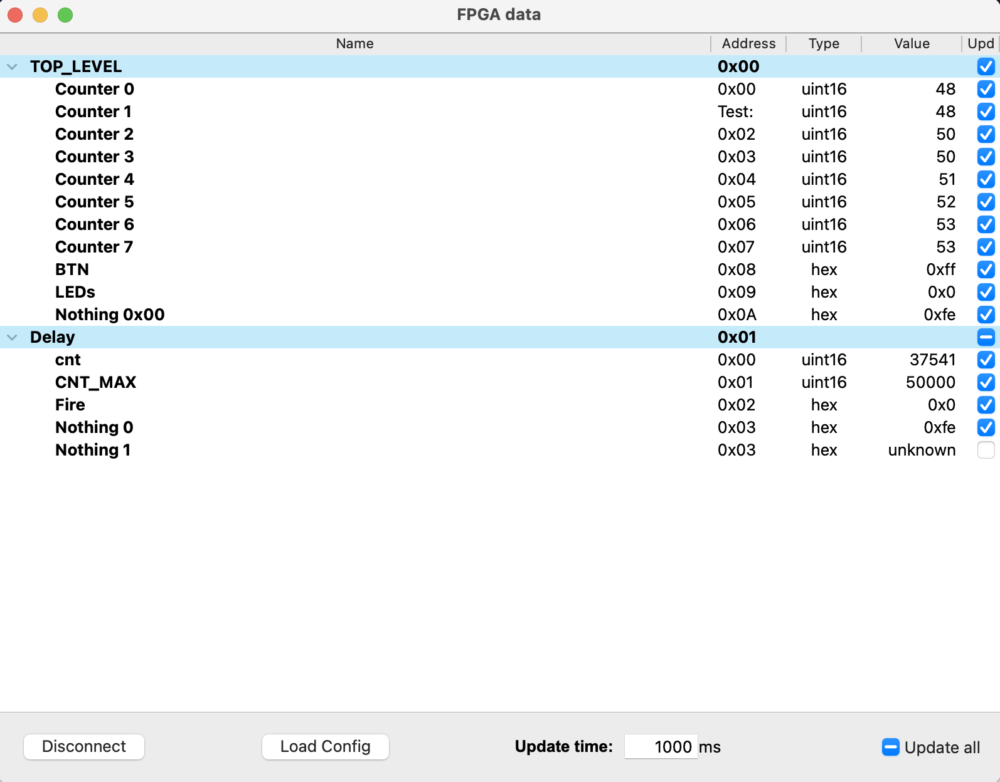

# Debug2UART

Universal Signal Tab for FPGAs. Allows you to readout any signal via a UART interface.

Debugging faulty VHDL code is more or less a pain in the a**. Each FPGA Vendor offers a different tool suite to help with this problem. E.g. Microchip’s Libero offers SmartDebug Design which, however, is everything else than smart. It randomly crashes and, due to its post synthesis nature, does not allow to tab into passthrough signals. Only FlipFlop outputs are supported.

To simplify the debugging process, we developed a small interface called bus2uart. This interface allows to connect a simple UART transceiver to two FPGA pins, over which the state of any signal can be read. While it currently does not support any triggering, it is still very useful when debugging FPGA designs.

## Setup

1. Make sure you have two pins of your FPGA left. Connect these pins to a UART transceiver and install the corresponding drivers for this transceiver on the PC side.

2. Add *debug2uart* library and files to your project.

3. Add *bus2uart_core* to your top level entity.

    ```VHDL
    library debug2uart;
    use debug2uart.all;
    ... 

    entity top_level is
        port (
            clk   : in std_logic;
            reset : in std_logic;
            ...
            -- Test UART
            UART_RX : in std_logic;
            UART_TX : out std_logic
        );
    end top_level;
    architecture behavior of top_level is
        ... 
        
        -- TEST interface
        constant TEST_BAUDRATE : natural := 115200;
        signal test_sdi : test_sdi;
        signal test_sdo : test_sdo;

    begin
        .... 
        
        TEST_I : entity lib_debug2uart.bus2uart_core
            generic map (
                CLK_FREQ   => CLK_FREQ,
                BAUD_RATE  => TEST_BAUDRATE
            )
            port map (
                clk     => clk,
                reset   => reset,
                UART_TX => UART_TX,
                UART_RX => UART_RX,
                -- Test interface
                test_sdi => test_sdi,
                test_sdo => test_sdo
            );
    end behavior;
    ```

4. Add the bus system to any module you want to test and include an address for each module as follows:

    ```VHDL
        ...
        example_i: entity work.example
            generic map (
                clk_frequency => CLK_FREQ,
            )
            port map (
                clk   => clk,
                reset => reset,
                -- test interface
                TEST_SEL_ADDR => x"01", -- specific address for module (could also be a generic)
                test_sdi      => test_sdi,
                test_sdo      => test_sdo
            );
        ...
    ```

    All addresses must be unique to prevent bus write conflicts. It's good practice to reserve address ```0x00``` for the ```top_level``` entity.

5. To debug a specific signal, connect it to the bus for a certain address. Use the following code as an example:

    ```VHDL
        ...
        -- Internal Test mux signal
        signal test_read_data_int : std_logic_vector(TEST_DATA_WIDTH-1 downto 0);
    begin
        ... 
        -- Test interface
        test_sdo.data_rd <= test_read_data_int when test_sdi.sel = TEST_SEL_ADDR else (others => 'Z');
        -- Muxer
        TEST_PROC : process(test_sdi.addr)
        begin
            -- standard value is 0
            test_read_data_int <= (others => '0');
            case test_sdi.addr is
                when x"00"  => test_read_data_int(counter'left downto 0) <= std_logic_vector(counter);
                when x"01"  => test_read_data_int(BTNs'left downto 0)    <= BTNs;
                when others => test_read_data_int(7 downto 0)            <= x"fe";
            end case;
        end process;
        ...
    ```

6. Synthesize your design. If it does not fit the target FPGA after the adjustments, you need to either remove a certain module or reduce the number of entries that are passed to the debug interface. Make sure the pins you selected in **1.** are connected to ```UART_TX``` and ```UART_RX``` of ```bus2uart``` correspondingly.

7. Provide a JSON file with the signal addresses and types. An example file is shown below:

    ```JSON
    {
        "TOP_LEVEL" : {
            "hex": "0x00",
            "signals" : {
                "Signal 0" : {
                    "hex": "0x00",
                    "type": "int32"
                },
                "Signal 1" : {
                    "hex": "0x01",
                    "type": "uint16"
                }
            }
        },
        "EXAMPLE_I" : {
            "hex": "0x01",
            "signals": {
                "counter" : {
                    "hex": "0x00",
                    "type": "uint16"
                },
                "BTNs" : {
                    "hex": "0x01",
                    "type": "hex"
                }
            }
        }
    }
    ```

    Another example can be found [here](software/uart2bus.json).
    The file shall contain all signals to debug as the key entry. Each entry then needs to contain a “hex” key that provides the address of the 32 bit register send over the interface. Optionally you can provide the signals “type” for proper formatting.  The default format is 32 bit hexadecimal.

8. Run the python tool: [uart2bus.py](software/uart2bus.py)  

    ```bash
    python uart2bus.py COM3 --baud 115200 -u 0.1 --cfg uart2bus.json -h

    usage: uart2bus.py [-h] [--baud BAUD] [-u UPDATETIME] [--cfg CFG] port

    Signal tap interface to readout signals on an FPGA over a uart connection.
    Use in conjunction with the debug2uart_register or debug2_uart_ram VHDL module.
    Based on your design, provide a corresponding JSON file with signal names, 
    addresses and data types.

    positional arguments:
    port                  SerialPort path. COMX on windows, /dev/ttyXXX on Unix/Posix systems.

    options:
    -h, --help            show this help message and exit
    --baud BAUD           Baudrate of serialport
    -u UPDATETIME, --updateTime UPDATETIME
                            Time in seconds to update all values
    --cfg CFG             JSON with register configuration
    ```

    You can now connect to the SerialPort in the GUI that opens and display all signal values. 

<p align="center">

</p>

## Usage

Example usage for around 11 32 bit signals with pruning enabled.

| Module Name                                                    | Fabric 4LUT | Fabric DFF |
|----------------------------------------------------------------|-------------|------------|
| /bus2uart_core/Primitives                                      | 142         | 60         |
| /bus2uart_core/uart_i/Primitives                               | 1           | 2          |
| /bus2uart_core/uart_i/os_clk_divider_i/Primitives              | 9           | 6          |
| /bus2uart_core/uart_i/uart_rx_i/Primitives                     | 10          | 14         |
| /bus2uart_core/uart_i/uart_rx_i/rx_clk_divider_i/Primitives    | 6           | 5          |
| /bus2uart_core/uart_i/uart_tx_i/Primitives                     | 22          | 17         |
| /bus2uart_core/uart_i/uart_tx_i/tx_clk_divider_i/Primitives    | 7           | 5          |
| /bus2uart_core/uart_i/use_debouncer_g.debouncer_i/Primitives   | 3           | 4          |
| **SUM: bus2uart_core**                                         | **200**     | **113**    |

## Kudos

Kudos go to Jakub Cabal for his clean [UART interface](https://github.com/jakubcabal/uart-for-fpga).
